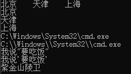
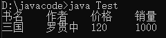

# ·Java转义字符


\t ：一个制表位，实现对其的功能

\n ：换行符

\\\ ：一个\

\\" ：一个“

\\'  ：一个’

\r ：一个回车


## 代码示例

```
//演示转义字符的使用
public class ChangeChar {

	//编写一个main方法
	public static void main(String[] args) {
		System.out.println("北京\t天津\t上海");
        // \t实现制表位对齐
		System.out.println("北京\n天津\n上海");
		// \n实现换行
		System.out.println("C:\\Windows\\System32\\cmd.exe");
		System.out.println("C:\\\\Windows\\\\System32\\\\cmd.exe");
		// \\ : 一个\
		System.out.println("我说\"要吃饭\"");
		// \" : 一个"
		System.out.println("我说\'要吃饭\'");
		// \" : 一个'
		System.out.println("南京孝陵卫\r紫金山");
		// \r : 一个回车
		// \r将光标移至当前行的最前端，用\r后面的字符依次代替
	}
}
```

## 运行结果




# 练习

编写代码，用一个输出语句实现以下的输出结果




### 代码如下

```
public class ChangeCharEx {

	//编写一个main方法
	public static void main(String[] args) {
		System.out.println("D:\\javacode>java Test\n书名\t作者\t价格\t销量\n三国\t罗贯中\t120\t1000");

		
	}
}
```

